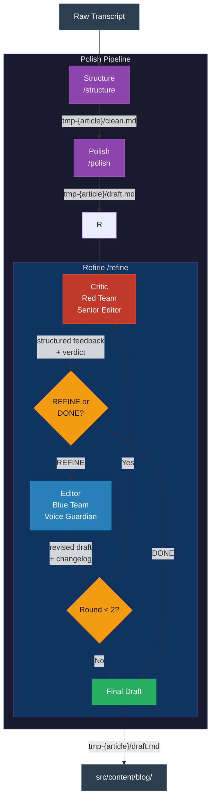

# Personal Blog

Blog posts written from talks and interviews. Raw transcripts go in, polished posts come out — with my voice intact.

Posts live in `src/content/blog/` as Astro-compatible markdown. Transcripts live in `transcripts/`.

## Pipeline

Transcripts are converted to blog posts through a three-step pipeline, invoked with `/polish-pipeline`:



### Steps

1. **Structure** — Cleans the raw transcript (filler, stutters, repetition), finds the hook, identifies sections, tags peak moments. Output: `clean.md`.

2. **Polish** — Transforms the structured draft into a blog post. Edits for readability while preserving the speaker's voice, vocabulary, and rhythm. Output: `draft.md`.

3. **Refine** — Adversarial quality loop. A Critic (Red Team) reviews the draft against reader-experience principles and an Editor (Blue Team) applies fixes while guarding voice. Runs up to 2 rounds or until the Critic signals the draft is ready. Output: refined `draft.md` + `refine-log.md`.

### Supporting skills

- `/voice-profile` — Analyzes transcripts to build a persistent voice profile (tone, vocabulary, rhythm, signature phrases). Run this first for best results.
- `/refine` — Can be run standalone on any draft, not just pipeline output.

### Usage

```
/polish-pipeline transcripts/my-talk.md
/polish-pipeline transcripts/my-interview.md --mode interview
```

When happy with the draft, move `tmp-{article}/draft.md` to `src/content/blog/[slug].md`.

## Audio Narration

Blog posts can be narrated in the author's cloned voice using [Qwen3-TTS](https://huggingface.co/Qwen/Qwen3-TTS-12Hz-1.7B-Base) running locally on Apple Silicon via [mlx-audio](https://github.com/Blaizzy/mlx-audio).

### Setup

Requires macOS with Apple Silicon (M1+), `ffmpeg`, and `uv`:

```bash
brew install ffmpeg        # if not already installed
uv sync                    # install TTS dependencies
uv sync --extra transcribe # optional: auto-transcription via mlx-whisper
```

This creates a `.venv/` with `mlx-audio`, `soundfile`, `numpy`, and optionally `mlx-whisper`. The first TTS run downloads the Qwen3-TTS model (~3.8GB, one-time).

### Voice cloning

Drop an audio recording of yourself into `recordings/`, then:

```
/voice-clone recordings/my-talk.mp3
```

This extracts a clean reference clip, transcribes it, generates a test sample, and saves everything to `src/assets/voice/`. Listen to `src/assets/voice/test-clone.wav` to verify.

### Narrating a post

```
/blog-narrate building-genai-is-80-percent-engineering
```

This reads the markdown, strips formatting into spoken prose, generates audio with your cloned voice, and saves the MP3 to `public/audio/{slug}.mp3`. The post's frontmatter is updated with an `audioUrl` field.

### How it works

```
recordings/my-talk.mp3
        │
        ▼
  /voice-clone ──► src/assets/voice/reference.wav + reference.txt
                              │
                              ▼
  src/content/blog/*.md ──► /blog-narrate ──► public/audio/{slug}.mp3
```

- **Model**: `mlx-community/Qwen3-TTS-12Hz-1.7B-Base-bf16` (voice cloning via 3s+ reference audio)
- **Output**: 24kHz mono MP3, ~128kbps
- **Speed**: ~1.67x real-time on Apple Silicon
- **License**: Apache 2.0
