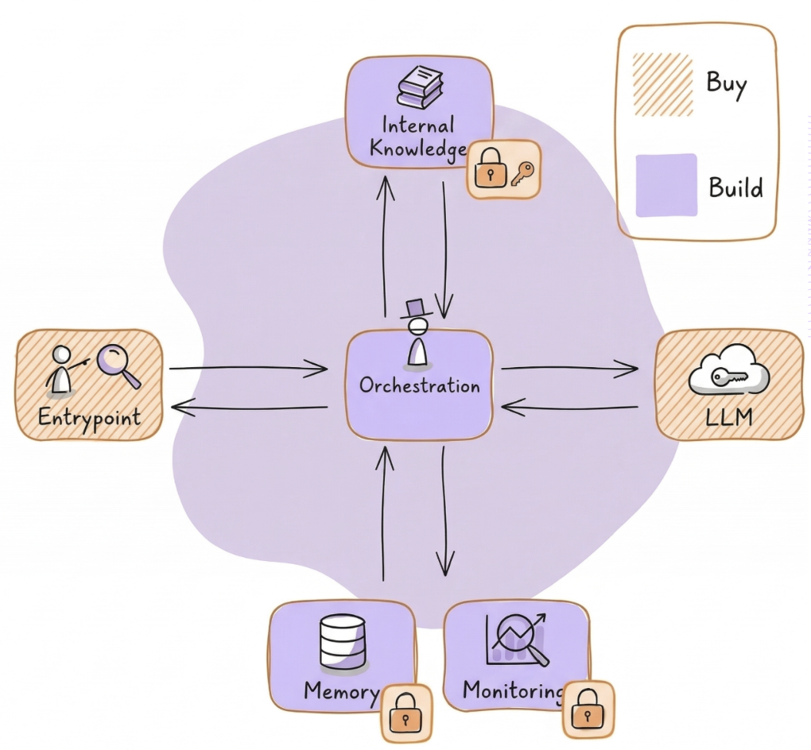
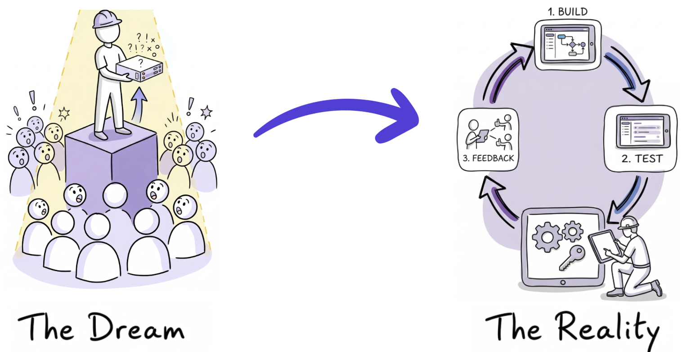
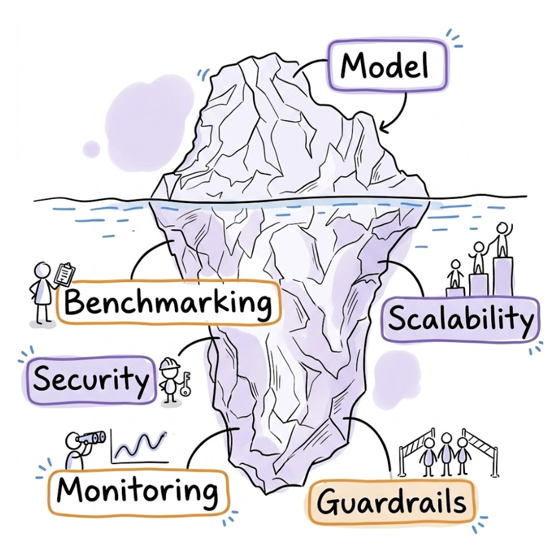
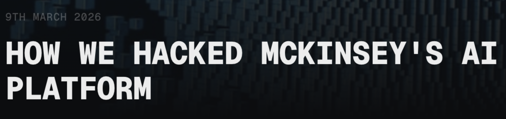

How many GenAI pilots actually make it? 5%. [MIT, 2025](https://fortune.com/2025/08/18/mit-report-95-percent-generative-ai-pilots-at-companies-failing-cfo/).

I am not surprised. I mean, you know how it goes. The demo works, leadership gets super excited, and suddenly they want it in production yesterday. With the same team. And the same POC you put together in two weeks.

Take [Klarna](https://www.bloomberg.com/news/articles/2025-05-08/klarna-turns-from-ai-to-real-person-customer-service). They reduced customer service staff and replaced them with agents. Soon after, they realized the quality was not there and started hiring people back. We have seen it everywhere lately: AI as a front to cut costs. But then... reality hits. Wrong reason, wrong result.

So how do you make sure your GenAI solution actually makes it? What makes them fail?

Almost a year ago I started building an agentic solution for knowledge retrieval at a large company (+6k employees). This is what I have learnt so far.

## What Does It Actually Take?

It starts before you write a single line of code.

> Is the problem worth solving? Are agents the actual solution? Do you have solid foundations in place?

Nobody wants to answer those. They want to skip straight to the fancy agent. But if you skip them, you are already in the 95%.

Once you get those right, it's time for the engineering questions: What should we buy and what should we build? And how do we build things right?

I am an engineer. So that's where I'll focus.

## What Should You Buy and What Should You Build?

When you open your LinkedIn, you think that building an agent is just plumbing: API here, MCP there, and pum! My first agentic solution. When you are in a large enterprise, that is not enough. Now you have to care about scale, security, user experience, all at once, for thousands of users with different profiles, expectations, and AI knowledge.

But don't worry. This is what makes building in production actually fun, at least for me. At the same time, the space is evolving so fast that it's overwhelming. You can build everything! Combine that with your latest AI coding tool and the possibilities are really endless: MCPs, Skills, sub-agents, self-learning agents...

*You can build Everything! Don't*

That's the first mistake to avoid. Please, breathe. Take a step back. Ask yourself: Who are my users? What do they really need? Then, start with the minimum viable and iterate.

*This is Dobby. Dobby is chill. Be more like Dobby before building stuff*

In our case, we were working in the Azure ecosystem. The thing is, when you are in a big organization, you already have a lot of tools at your disposal. We used the Copilot frontend with our own custom orchestration behind it. Why would we spend time and money building a frontend for LLMs when there is already one that works properly?

> Buy the thing that is not your core value, build the thing that makes you unique.

And don't even think about training your own LLM. I mean, the organization is really big, you could think about it, but that's a lot of money to not get a good solution.

We also thought about fine-tuning, but the thing is, you can have indirect knowledge leakage. Imagine a large enterprise where different teams work on confidential projects. If you fine-tune on all of that data, the LLM memorizes it, and suddenly someone from Team A can extract knowledge about Team B's work just by asking the right questions. So fine-tuning was out too.

So where can you bring the value? If you think about the stack, you have the entrypoint, the orchestration, the LLM. The entrypoint? Buy it. The LLM? Buy it. But the orchestration and the tools? That's where you as an engineer can bring the most value.

We built the custom tools using Skills + custom APIs, which allows us to plug and play into different agents and be more future proof. And for the orchestration we went with Agno, which gives us full control over the workflow, the reasoning loop, the tool calling. That control matters. An agent is basically an LLM in a loop. If you don't own that loop, you can't tune how the agent reasons. That's the stuff that makes your solution unique.

*What we built vs what we bought.*

## Building Things Right

Most of what I have learnt from taking a POC into production is not even GenAI related. That's the whole point of this article.

### Agentic AI Solutions Are Products

They are not a one-off thing. They are not demos that you do to impress your boss and get a promotion. If your solution is good, it's going to be used by a lot of people. A lot.

*Us the first week at the job vs now.*

We started as a small POC team. We had two weeks to prove the system worked. If we didn't show value, the project was dead and the client was going with another company. We won that battle because we focused on making the retrieval accurate instead of going vanilla. The users said they would actually use it in their daily work. We won the buy versus build. Good.

But then the hype kicked in. The news reached the board of directors, one of them used the system for a presentation and was quite happy. And suddenly management said, drop everything, deliver by January instead of March. They were like, how hard can it be? Just put 20,000 documents in. They didn't understand the difficulty. And we couldn't really explain it to them either.

So we had to sit down, make a proper plan, define the non-negotiables and bring a structured message to leadership. If you want January, fine, but this is what we can deliver. Is it good enough?

> Don't fly blind.

It does not matter how tight the timeline. What matters is whether you are building what your users actually need. And the only way to know that is to build it together with them.

We have learnt so much from our users. About things that we thought were important, and were not at all. About things that were not in our roadmap and were a must.

Early user feedback told us the system was too slow, so we added streaming responses and progress updates. Users loved being able to download the source documents directly. These were not fancy features, but they made a real difference. The next feature you develop has to come from that kind of feedback, not because you saw a new cool skill and wanted to implement it.

### GenAI Is 80% Engineering

My favorite lesson. GenAI is 80% engineering. I call it the "boring work."

I have been on both sides of the coin. In the POC we were like two chickens without heads doing bash scripts and random things to deploy containers. That was a mess. But the moment that we sat down and said, let's put proper infra, let's put proper CI/CD, every time we make a change now it's so easy. I'm quite happy about that.

*The boring work is invisible, but keeps you afloat.*

It took me and my team a couple of months building a good foundation before we could start playing with the fun stuff. Private networking, JWT token validation, WAF protection, CI/CD, observability, scalability. None of that is GenAI. All of it is required.

Getting security right was the best example. The data is private IP, so the raw data cannot be publicly reachable on the Internet. We had to set up virtual networks, subnets, NSGs, an application gateway to allow the frontend to talk with the backend safely through the public internet. We have to handle proper role based access control, fine-grained permissions, entra IDs of the users, you name it.

Tortuous process, believe me. But the happiness that you get when the first message flows through all the layers and you get back an answer, priceless.

But that happiness only lasts because you did the work upfront. Skip it, and you end up like [McKinsey's AI platform](https://salt.security/blog/mckinsey-hack-exposed-apis): they were hacked, not because of prompt injection or jailbreaking per se, but because they had 20 APIs publicly available without even a static key protecting them. That's just an engineering issue. Not GenAI.

*Imagine my first thought when I read this...*

I was a bit scared when I read that. Could that happen in the solution I had been building this year? Then I remembered those couple of months of boring work. And I went back to sleep like a baby.

### Don't Fall in Love With the Solution

The space moves fast. What you built three months ago might not be the right answer anymore. Your first instinct is to fix what you have. Sometimes the right call is to let go and rebuild.

We went through this multiple times. Our first database was Cosmos DB. It worked for the POC, but when we did load testing, it could not handle what we needed. We tried to fix it by dropping hybrid search, but then the retrieval quality dropped. At some point we had to say, okay, this is not going to work, let's move to PostgreSQL.

Same with the orchestration framework. We started with Microsoft's agent framework because we were in the Microsoft stack. It made sense. But as the solution grew, we realized it was not going to give us the control we needed. So we migrated the whole codebase to Agno. That was not a fun week.

The thing is, you cannot get attached to your decisions. The sunk cost is real, the frustration is real, but if you hold on to something that is not working just because you already built it, you are slowing yourself down. In this space, the ability to pivot fast is more valuable than getting it right the first time.

### Context Is King

The trivial one in hindsight. If you have not ingested the right data for your users, it does not matter how much agentic magic you throw at the problem. The insights are just not going to be there.

We were quite humbled by our users at the beginning of our testing sessions. We had been optimizing the retrieval for the difficult questions. The first data source was slides with complicated graphs, so text embeddings were a no-go. We chose a multimodal embedding model, combined semantic and keyword search, added query rewriting so the agent wouldn't lose context across turns.

All of that worked quite well for the hard questions. Then, our users said:

> your system sucks

Why? Because a user asked who they should contact in the company for a question about X, and the system hallucinated the names. The response was good, the knowledge was there, but we hadn't ingested the HR data just yet. We thought it was not a priority.

## The Other Side

I am writing this from the other side. Things worked out. But I would be lying if I said it was always clear that they would.

There were quite some moments along the way where it could have gone differently. A stakeholder losing patience. A pivot that took longer than expected. A demo that almost did not work. When you are in a high-priority project with a lot of visibility, small mistakes get amplified. The pressure is constant.

What got us through it? Listening. The gap between what engineers think matters and what users actually need, that is where the 95% fails. Not because the models are not good enough. Not because the tech is not there. But because shipping GenAI is not a tech problem. It's a product problem, an engineering problem, and a listening problem.

We are still at the beginning. There is a lot we have not figured out. Benchmarking is the big one. The questions our users ask are so specific that getting ground truth data is really, really difficult. We are about to ingest a lot more data and we know the orchestration is going to get more complex. And adoption? Convincing people to change how they work is harder than building the thing in the first place. There is a lot of internal marketing effort that nobody warns you about.

But that is a problem for future us.

## The Bottom Line

If I had to distill a year of learnings into a few lines:

- **Make sure the problem is worth solving.** Not "leadership wants AI" worth solving. Actually worth solving. We almost skipped this.
- **Buy what is not your core value. Build what makes you unique.** Why would you build a frontend when there is one that works properly? But the orchestration, the tools, that is where we brought the value.
- **Build with your users, not for them.** We only made it because we listened. Every time we thought we knew better, we were wrong.
- **Do the boring work.** 80% of shipping GenAI is engineering. Networking, security, CI/CD, observability. None of it is fancy but all of it is required. And when things go wrong out there, it is the boring work that lets you sleep like a baby.

The boring stuff is what keeps you in the 5%.

PS: Thanks to the great Jonny Daenen for the inspiration for the drawings.