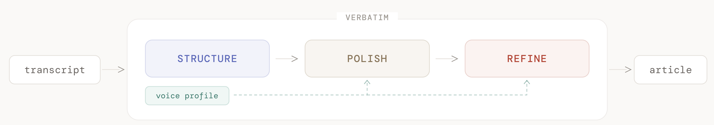
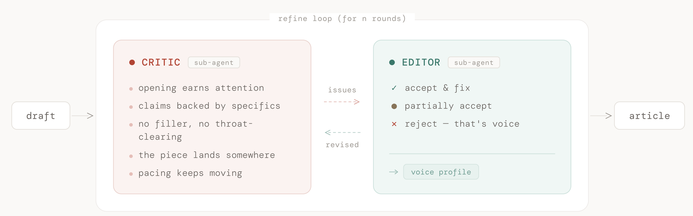

There's a quote from Arthur Plotnik, who wrote *The Elements of Editing*, that I keep coming back to:

> You write to communicate what's running inside you, and we edit to let the fire show through the smoke.

The fire must come from the writer. AI can't start it, but it can clear the smoke.

## Why a Blog

I love talking. I love sharing what I know. I've given maybe fifteen talks in the last two years (at this point my colleagues probably see my name on the agenda and think, *here we go again*). But the thing with spoken words is that they vanish. They get scattered. And I wanted to have all of that together somewhere.

So I thought writing would be the best option. A blog. But I'm quite a perfectionist. I'd try to write a sentence, spend hours on it, and come up with nothing. So I stopped trying.

*Yup, that's me. For hours. Looking at a blank page.*

## The Wrong Idea

Then AI came and I thought, maybe we can write blog posts using my ideas. Just tell AI to write it in my style. I tried a few times and ended up with your typical AI slop LinkedIn post:

> *As engineers, we often find ourselves at the intersection of innovation and communication. I've always been passionate about sharing knowledge — but transforming spoken insights into written content can be incredibly challenging. That's why I decided to leverage the power of AI — not just as a tool, but as a partner — to streamline my content creation workflow.*

That's me wearing a suit trying to impress some imaginary board of directors. So I stopped again.

But then I realized something. **We should not use AI to write anything per se, but to edit.** And that's how Verbatim was born.

Verbatim is a plugin for Claude Code. You feed it a transcript from one of your talks, and the pipeline does what a good editor would do: finds the structure, cleans up the spoken mess, and turns it into something you'd actually want to read.

## How It Actually Works

The principles behind good editing are quite old. Maxwell Perkins was editing Hemingway in the 20s. Newsrooms have run writer-editor loops for decades. But now we have AI, LLMs, agents, sub-agents, skills. And I think we finally have the tools to encode that process into a pipeline.

You have three steps.

First, **structure**. You go from your raw transcript to a clean draft. It removes the filler words, the false starts, the moments where you said the same thing three times while finding your point. But it keeps the good stuff. It tags what it calls "peak moments," the sharpest analogy, the best story, the line that makes the whole section click. Those get protected through the rest of the pipeline.

Then **polish**. This is where spoken word becomes written text. Your voice profile is loaded here, so the pipeline knows that when you say "super important" it should stay "super important" and not become "particularly noteworthy." It also runs an anti-slop filter, a list of banned phrases that scream AI-generated content. If "let's dive in" or "passionate about" shows up, it gets killed.

And finally **refine**. This is the adversarial part, a critic and an editor arguing over your draft.

## The Voice Profile

You feed it a few of your transcripts or writing samples, and it figures out how you actually talk. Not just what words you use, but the patterns. How long your sentences run. Whether you ask rhetorical questions. Whether you soften things with "let's say" or just say what you think. It noticed I start arguments with *"the thing is"* and use *"quite"* as my default intensifier. It knows I say "fancy" instead of "sophisticated" and "but" instead of "however." These kind of things.

Without it, the pipeline would still work. But the output would sound like a generic blog post that happens to contain your ideas. With it, the output sounds like you sat down and wrote it yourself.

## The Adversarial Loop

Refine spins up two sub-agents that argue with each other: a critic and an editor. Same idea as in newsrooms. You write something, your editor pushes back, you go back and forth.

The thing is, the critic doesn't care about style. It only evaluates against a set of principles: does the opening earn attention? Are claims backed by specifics? Does the piece land somewhere? This is something I picked up from [Constitutional AI](https://www.anthropic.com/research/constitutional-ai-harmlessness-from-ai-feedback), the idea that you critique the *what*, not the *how*. If the critic starts saying "make this punchier" or "more engaging," it's game over for your voice. But "this claim has no example backing it up"? That's useful feedback no matter who you are.

The editor can reject feedback. And it should. If the critic flags "super cool" as too informal, the editor looks at the voice profile and says no, that's how this person talks. That rejection is super important. Research on [multi-agent writing systems](https://www.emergentmind.com/topics/llm-driven-feedback-loops) shows that unlimited revisions strip personality. Each pass removes a little bit of you. So you need a stopping condition, not a fixed number of rounds. The critic returns DONE when it can't find real issues anymore. Two rounds, not ten.

The tension is a feature. The critic pushes for quality. The editor pushes for voice. And there should be a good balance between the two.

*The editor going through the critic's notes. Again.*

## Just the Beginning

[Verbatim](https://github.com/jesgarram/verbatim) is open source and the pipeline is quite easy to set up. It handles the craft, but it can't give you something to say. That part is still on me.

Every post goes through this pipeline. And right now, you're reading the output of it.
